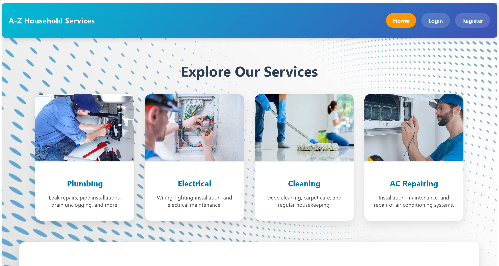
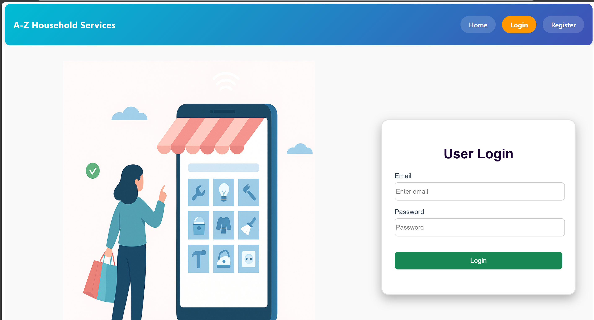
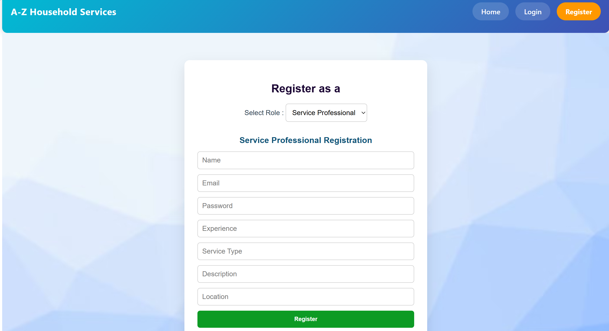
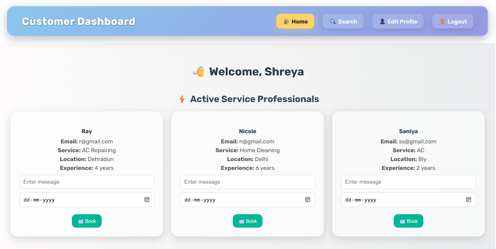
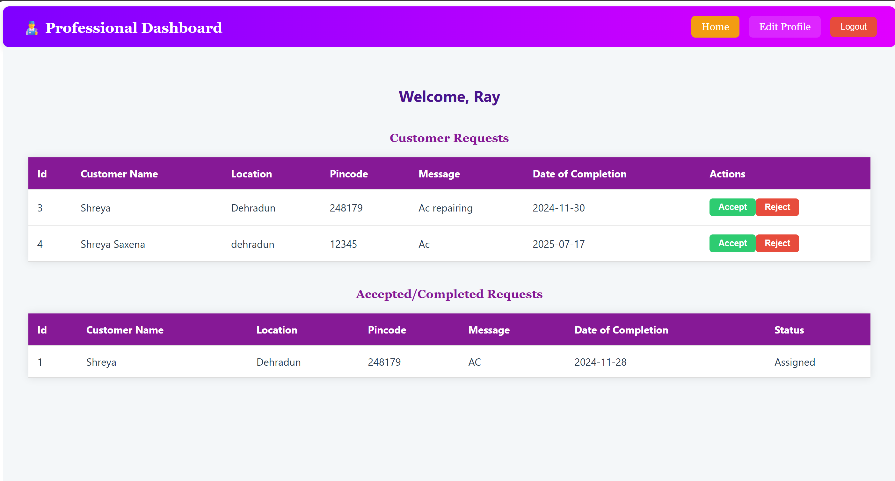

# 🛠️ A-Z HouseHold Services – Home Service Platform (Multi-User Web App)

**A-Z HouseHold Services** is a multi-user web application designed to serve as a platform for providing comprehensive home servicing and solutions. It supports three distinct user roles: **Admin**, **Service Professionals**, and **Customers**.




The application facilitates the complete service workflow — from service request creation to professional response and job scheduling. Each user has their own personalized dashboard to manage their activities.

---

## 🔍 Features

- **Customer Dashboard**
  - Book services based on categories
  - Track request status
  - View service history
  - Receive notifications for service updates

- **Service Professional Dashboard**
  - Accept or reject service requests
  - Manage scheduled services
  - Access service history and earnings

- **Admin Dashboard**
  - Perform CRUD operations on services
  - Manage users (professionals & customers)
  - Monitor platform analytics and activity logs

- **Authentication & Security**
  - User registration and login with role-based access control
  - Secure sessions with token-based authentication
  - Email notifications for password resets and service updates

---

## 🧰 Tech Stack

### ⚙️ Backend
- **Flask-RESTful** – To build modular and scalable REST APIs  
- **Flask-Security-Too** – Provides authentication, registration, role management, and security  
- **Flask-Mail** – For sending verification and notification emails  
- **Flask-SQLAlchemy** – ORM for handling database models and queries  
- **SQLite** – Lightweight local database for development and testing  
- **Redis** – In-memory caching system to improve performance  
- **Celery** – Handles asynchronous task execution (e.g., email sending, job scheduling)  

### 🎨 Frontend
- **Vue.js 3 (Vue CLI)** – Reactive JavaScript framework for building user interfaces  
- **Jinja2** – Template engine used for rendering dynamic HTML on server-side  
- **Axios** – Promise-based HTTP client for API interaction  
- **Vue Router** – For managing navigation and routing between components  

---

## 🖼️ Screenshots

| Login Page | Register Page |
|--------------------|----------------------|
|  |  |

| Customer Dashboard | Professional Dashboard |
|------------------------|------------------|
|  |  |


---

## 🚀 How to Run Locally

### Backend Setup

```bash
# Clone the repository
git clone https://github.com/shreyasaxena21/Household-Services-MAD2-Project
cd Household-Services-MAD2-Project/backend

# Create virtual environment
python3 -m venv .venv

# Activate the virtual environment
source .venv/bin/activate

# Install dependencies
pip install -r requirements.txt

# Start MailHog (for testing email functionality)
~/go/bin/MailHog

# Start Celery worker
celery -A app.celery worker --loglevel=info

# Start Celery beat
celery -A app.celery beat --loglevel=info

# Run Flask app
python app.py
```

### Frontend Setup

```bash
cd ../frontend

# Install dependencies
npm install

# Start development server
npm run serve
```
## 🔒 Security and Performance
- Token-based authentication and session management

- Redis caching for database query optimization

- Background jobs for non-blocking email and notification services

## 📬 Contact
- For queries, suggestions, or contributions:

- 📧 Email: shreyasaxena2104@gmail.com

- 🌐 GitHub: https://github.com/shreyasaxena21
